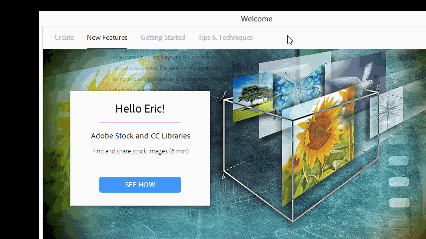

1.  Open This PC and open the V: drive and create a folder with that Sundays Date (YYYY-MM-DD)+pastor+sermon title for example: 2015-01-01-Pastor-Sermon-Happy-New-Year
    1.  Eric will try to create these for you in advance.
2.  Capture the video on camera to the two memory cards, Card A for 9:00 and Card B for 10:45
3.  There are two ways to copy the footage over:
    1.  Insert the Card into the Memory Card reader on the GCC1219 Video Editing Computer
        1.  Open the Canon XF Utility or download and install it, for the Canon xf305 camera.
        2.  Highlight all the clips in the top window by dragging over them with the mouse or shift clicking.
        3.  With the clips you want exported click the Edit Menu > Export to MXF&hellip;
        1.  Export Method = Merge Each Clip
        2.  Folder for Exported Files = The current weeks video folder on the Video Drive
            1.  Automatic Creation of Subfolders = Checked
        3.  To keep it simple do not rename the files
        4.  Audio Output: 2 Channels
        5.  16-Bit for the Bitrate
        6.  Hit Export it will take 10-15 minutes if the card is full.
    1.  Open up This PC (Windows Explorer)
        1.  Right click on the CANON XF Folder and copy it
        2.  Open the project folder you created in step 1
            1.  Create a Folder with the service time
            2.  Paste the CANON XF Folder into it
            3.  Repeat this step for each service

    3.  Open Premiere Pro to edit the video.
    4.  Select New Project
    5.  Give the Project the same name as the folder it is saved in.
    6.  Hit OK
    7.  Navigate to the Media Browser and Navigate to the place where you imported that weeks media, Right click on the media and select Import, this will copy it to your project.
    8.  In the Project view drag the video file to the new sequence button and it will create a sequence that has all the right settings based off of the video file.

    9.  Edit the video as you normally would
    10.  Things to Consider:
        1.  Audio 1 or left Chanel is the good clean XLR Audio. If you put the effect “Fill Left” on a stereo track it will make it all left and the same with the “Fill Right” effect.
        2.  Right Click on the audio Track and select audio gain to increase the volume in a way that will show on the waveforms.
        3.  If you are used to Final Cut you can change the keyboard shortcuts to those shortcuts in the edit menu.
    11.  When you are done editing make sure that there are no gaps at the front or the end of your track and with the sequence selected File-Export-Export Media (ctrl+m)
        1.  Select H.264 in format
        2.  Scroll all the way to the bottom in preset
        1.   Select YouTube HD 1080p and put it in the V: Drive Renders Folder.
        1.  Also Add a MP3 export so You can put it on the website
    1.  When the file is done exporting use Google Chrome to upload it to YouTube (https://www.youtube.com/upload)
        1.  Username = graceinauburn
        2.  Password = ASK FOR IT ;)
        3.  Name the Video SERIES TITLE – SERMON NAME For example: Living Proof – How to live a life
2.  Open that week’s PowerPoint and export the Sermon Name slide as a PNG and upload that to YouTube as a custom Thumbnail.
    1.  Hit Publish and you are pretty much done.
